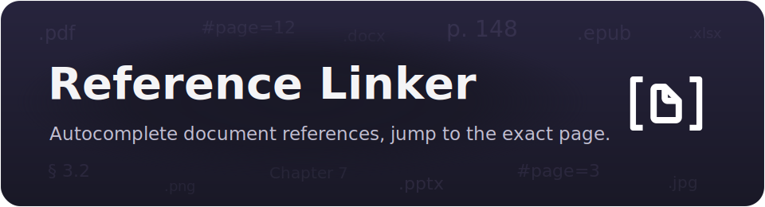

<p align="center">
  
</p>

# Reference Linker

<p align="center">
  <a href="https://github.com/max-fluff/obsidian-reference-linker/releases/latest"></a>
  <a href="LICENSE"></a>
</p>

An Obsidian plugin that autocompletes links to your **external documents** — PDFs, Office files, images — and inserts a markdown link that opens the document in your default app, **at the right page**. For PDFs it also indexes the outline, so you can link straight to a section, preview the page on hover, and embed it inline.

It's the document counterpart to [Code Linker](https://github.com/max-fluff/obsidian-code-linker) (which does the same for source code): your reference material lives in project folders, download folders or a research library **outside** the vault, and this plugin makes it as linkable as a note — without copying anything in.

> Desktop only. It reads files from disk through Node's filesystem API, which isn't available on mobile.

The plugin ships as `main.js`, `manifest.json` and `styles.css`. It scans the folders you configure and keeps the index in memory — there is **no index file to commit and nothing to generate**; the index is rebuilt on startup and on demand. PDF outlines and page previews use the pdf.js that Obsidian already ships, so no second copy is bundled. `main.js` is built from `src/` with esbuild (see [Development](#development)).

## Contents

- [What it does](#what-it-does)
  - [Autocomplete as you type](#autocomplete-as-you-type)
  - [PDF sections](#pdf-sections)
  - [Portable `{root}` links](#portable-root-links)
  - [Opening at a page](#opening-at-a-page)
  - [Hover preview](#hover-preview)
  - [Inline embeds](#inline-embeds)
  - [Keeping links current](#keeping-links-current)
- [Commands](#commands-command-palette-ctrlp)
- [Settings](#settings)
- [Skipped contexts](#skipped-contexts)
- [Public API](#public-api)
- [How it works](#how-it-works)
- [Development](#development)
- [Installation](#installation)
- [Compatibility](#compatibility)
- [Related plugins](#related-plugins)

## What it does

### Autocomplete as you type

Type a trigger (default `@!`) followed by a document name and pick a match. It indexes the files under your **Reference root** by name, with fuzzy matching. Suggestions are suppressed inside code blocks, inline code, frontmatter and existing links (see [Skipped contexts](#skipped-contexts)).

The inserted link looks like:

```markdown
[paper-with-outline](file:///{root}/papers/paper-with-outline.pdf)
```

Filter a common name by an inline prefix: an extension (`pdf:`, `png:`) or `sec:` to match only PDF sections.

### PDF sections

For a PDF, the plugin reads its **outline (bookmarks)** and indexes each section with its page number — the same idea as Code Linker indexing a symbol on its line, but a section on its page. So `@!intro` finds the *Introduction* section of a paper, and the inserted link carries that page:

```markdown
[Introduction](file:///{root}/papers/paper-with-outline.pdf#page=1)
```

A PDF with no outline is still indexed by file name; other document types (Office, EPUB, images) are indexed by name too.

### Portable `{root}` links

`{root}` is **not** expanded when the link is inserted — the note keeps the literal text `{root}` and a relative path, and the absolute base is filled in only when the link is opened or rendered. That keeps notes portable across machines: the file on disk holds a relative path, and each machine supplies its own **Reference root**.

### Opening at a page

Click a link and the document opens in your **OS default app**. When that app is a browser (the common default for PDFs), a `#page=` link jumps straight to the page.

The link is handed to the OS through the shell, so the `#page=` fragment survives intact — Obsidian's own external-link opener mangles it, so the plugin routes clicks on PDF-page links itself. The commands and the hover/embed headers open the same way.

### Hover preview

Hover a reference link to preview it without leaving your notes: for a PDF, the target **page** rendered to a canvas; for an image, the image itself. Rendering uses the pdf.js that Obsidian already ships (no second copy bundled). In live preview hold Ctrl/Cmd to show it (like a note preview); in reading view a plain hover is enough. Toggle it with **Preview on hover** in settings.

### Inline embeds

A fenced ` ```reference-link ` block renders a document **page or image inline** in the note — so the reference lives next to your writing without being copied in:

````markdown
```reference-link
papers/paper-with-outline.pdf#page=3
```
````

- A **path** (`papers/report.pdf`) shows the first page; add `#page=N` (or `:N`) for a specific page.
- A **name or section** (`Introduction`) is resolved through the index to its file and page.
- An **image path** shows the image.
- Optional `key: value` lines after the target tune it: `page: N`, `width: N`, `title: …`.

The header is clickable (opens the document at that page); right-click an embed for **Open** / **Refresh**. Embeds re-render when the index rebuilds, so an open embed follows changes on disk. The command **Insert reference embed** picks an entry and inserts the block.

### Keeping links current

A link stores the document's path (and, for a section, its page) at insert time. If the file moves or a PDF's outline shifts, that drifts. Two things help:

- **Mark stale links** (on by default) underlines reference links in both reading view and live preview: a **warning-coloured** underline when the target has moved or its section page drifted (fixable), and an **error-coloured** one when the document is gone.
- **Update reference links in this note** / **… in the whole vault** re-resolve each link by its name and rewrite the drifted path or page. Only links that resolve to a single index entry are touched; anything ambiguous or unrelated is left exactly as it was. Right-click a drifted link in the editor and choose **Update this reference link** to fix just that one.

## Commands (command palette, Ctrl+P)

- **Insert reference link** — insert a link at the cursor.
- **Insert reference link as…** — insert one link with a one-off viewer choice, leaving the default alone.
- **Open referenced document** — open the picked document without inserting.
- **Copy reference link** — copy the link with `{root}` resolved to the absolute path (a copied link is usually pasted outside the vault, where the portable token wouldn't resolve).
- **Insert reference embed** — insert a ` ```reference-link ` block.
- **Convert selection to reference link** / **Find and open document** — resolve the selection against the index, then convert it or open the document (one match acts directly, several open the picker).
- **Update reference links in this note** / **… in the whole vault**.
- **Rebuild reference index**.

The selection commands are also in the editor's right-click menu. Right-clicking an existing reference link adds link-specific items: **Copy reference link**, and **Update this reference link** when its target has drifted.

## Settings

**Reference index**
| Setting | Default | What it does |
| --- | --- | --- |
| **Reference root** | vault's parent folder | Base folder the scan paths resolve against. Empty = the folder containing the vault. |
| **Scan folders** | whole root | One path per line, relative to the reference root. Empty scans the whole root. |
| **File extensions** | — | Which file types to index, space- or comma-separated (`.pdf .docx .png`). **Empty = nothing is indexed** — set this first. |
| **Skip folders** | `.git`, `node_modules`, `.obsidian` | A bare name is skipped at any depth; a path with a slash skips only that folder. |
| **Auto-refresh index** | on | Watch the scan folders and rebuild when documents change. Not available on Linux (recursive watching) — rebuild manually there. |

**Suggestions & links**
| Setting | Default | What it does |
| --- | --- | --- |
| **Trigger** | `@!` | Text that starts a suggestion. (`@@` is Code Linker's default; `@!` avoids a clash when both are installed.) |
| **Min characters / Max results** | `1` / `12` | When suggestions appear, and how many. |
| **Viewer link preset** | file:// | The link format. With **ask-on-insert** you pick per link; add your own named URL templates under **Your viewers**. |
| **Editor context menu** | on | Add the convert/open items to the editor right-click menu. |

**Hover preview** — **Preview on hover** (on).
**Links** — **Mark stale links** (on).

### Styling

The stale/broken underline colours and style are exposed to the [Style Settings](https://github.com/mgmeyers/obsidian-style-settings) plugin under a *Reference Linker* section, and are plain CSS variables (`--reference-linker-stale-color`, `--reference-linker-broken-color`) you can override in a snippet.

## Skipped contexts

Suggestions never fire inside code blocks (` ``` ` and `~~~`), inline code, frontmatter, or existing `[[...]]` and `[..](..)` links. When a link is written into a Markdown table cell, the pipe is escaped so the table isn't broken. Stale/broken marks and the **Update reference links** commands skip links inside code too — there they're example text, not live links.

## Public API

The in-memory index is exposed at `app.plugins.plugins['reference-linker'].api`:

| Method | Returns |
| --- | --- |
| `getEntries()` | every entry — `{ name, kind, ext, path, page }` (`kind` is `file` or `section`) |
| `getFiles()` | one row per file — `{ name, path, ext, entries }` |
| `getStats()` | `{ files, entries, byExt, byKind }` |
| `find(text)` | entries matching a name or path tail |
| `linkFor(entry)` | the portable `[name](uri)` markdown link |
| `uriFor(entry)` | a ready-to-open absolute URI (`{root}` resolved) |
| `onChange(cb)` | subscribe to rebuilds; returns an unsubscribe function |
| `version`, `root()` | plugin version; the resolved reference root |

A DataviewJS example — count indexed documents per type:

````md
```dataviewjs
const api = app.plugins.plugins['reference-linker']?.api;
if (!api) { dv.paragraph('Reference Linker is not enabled.'); }
else {
  const { byExt } = api.getStats();
  dv.table(['Type', 'Count'], Object.entries(byExt));
}
```
````

## How it works

A rebuild re-reads only files whose modification time changed, so a large library re-indexes quickly and a PDF's outline is parsed only when that file actually changes. The per-keystroke check that suppresses suggestions in code, links and frontmatter tests just the cursor position, not the whole document.

The plugin reads documents from arbitrary paths on disk — that's the point, they live outside your vault — through Node's filesystem API. That's why it's desktop-only (`isDesktopOnly`), and why it asks for a **Reference root** rather than using the vault.

## Development

The plugin is written as small CommonJS modules in `src/` and bundled into `main.js` by esbuild. `main.js` is generated — edit `src/` and rebuild.

Generic code shared with the sibling linker plugins lives in `src/shared/`, a git submodule of [obsidian-linker-shared](https://github.com/max-fluff/obsidian-linker-shared). Clone with `--recurse-submodules`:

```sh
git clone --recurse-submodules https://github.com/max-fluff/obsidian-reference-linker
npm install      # once, installs esbuild
npm run build    # bundle src/ -> main.js
```

In an existing clone without the submodule, run `git submodule update --init` first.

`src/` layout:

- `main.js` — the `Plugin` class: lifecycle, settings, folder scan, link building; applies the mixins below.
- `constants.js` — default settings and the `file://` preset.
- `suggest.js` — the `EditorSuggest` that drives autocomplete.
- `filter.js` — the inline `pdf:` / `sec:` query filter.
- `pdf.js` — Obsidian's pdf.js via `loadPdfJs()`: outline reading and page rendering.
- `hover.js` — the page/image popover.
- `embed.js` — the inline ` ```reference-link ` block renderer.
- `actualize.js` — stale/broken detection and the "Update reference links" actions.
- `api.js` — the public API mixin (`app.plugins.plugins['reference-linker'].api`).
- `modal.js` — the fuzzy pickers (index entries, viewer formats).
- `settings-tab.js` — the settings UI.
- `folder-suggest.js` — filesystem folder autocomplete for the root/scan/skip fields (feature-detected).
- `shared/` — git submodule shared with the sibling linker plugins: markdown helpers, the i18n engine, the folder-list settings editor, and the family's branding generators (dev-only — nothing under `shared/branding/` is bundled).
- `locales/` — interface strings (English and Russian), fed to the shared i18n engine.

The header images are generated, not hand-drawn — `docs/branding.config.mjs` holds this plugin's mark, motif and copy, and the shared generators turn it into the assets:

```sh
npm run banner   # docs/images/banner.svg + social-preview.svg
npm run plates   # store screenshot backdrops -> docs/images/store/
```

`icon.svg` and `icon-mono.svg` are hand-written, and the config reuses their paths verbatim, so the mark on the icon, the banner and the store plates is one drawing. See [`BRANDING.md`](src/shared/branding/BRANDING.md) for the conventions.

To deploy into a test vault on each build, create `esbuild.local.mjs` exporting `deployTargets` (a list of plugin folders to copy the build into). `node_modules/`, `test-vault/` and `esbuild.local.mjs` are git-ignored.

## Installation

This plugin is desktop-only (it reads the filesystem). It isn't in the community catalog yet.

**Manually.** Download `main.js`, `manifest.json` and `styles.css` from the [latest release](https://github.com/max-fluff/obsidian-reference-linker/releases/latest) into `<vault>/.obsidian/plugins/reference-linker/`, then enable the plugin in *Settings → Community plugins*.

**Beta builds via [BRAT](https://github.com/TfTHacker/obsidian42-brat).** Add the repository `max-fluff/obsidian-reference-linker`.

After enabling, set **Reference root** and **File extensions** in settings — the index is empty until extensions are set.

## Compatibility

Requires Obsidian 1.4.0 or newer. Desktop-only — the index is built by reading the filesystem through Node's API, which isn't available on mobile. On Linux, **Auto-refresh index** isn't available (it relies on recursive `fs.watch`) — rebuild manually there; everything else works. Interface in English and Russian, following Obsidian's language.

Nothing below is required — the plugin runs on its own — but it cooperates with a few others if you have them:

- **[Style Settings](https://github.com/mgmeyers/obsidian-style-settings)** — a UI for the stale/broken underline colours and style.
- **[Dataview](https://github.com/blacksmithgu/obsidian-dataview)** — query the index from DataviewJS through the [public API](#public-api).

## Related plugins

Also by the author — the rest of the linker family. Two of them autocomplete a name into a deep-link that lands on the exact spot; two highlight words already in your notes and link them.

**[Code Linker](https://community.obsidian.md/plugins/code-linker)** — autocompletes references to your source code and inserts a deep-link that opens the file at the exact line in your editor (VS Code, JetBrains, …). Desktop-only. This plugin is its document counterpart — a section on its page instead of a symbol on its line.

<p align="center">
  <a href="https://community.obsidian.md/plugins/code-linker">
    
  </a>
</p>

**[Glossary Linker](https://community.obsidian.md/plugins/glossary-linker)** — highlights glossary terms in any word form, turns them into real links, and learns new aliases from links you've already made. Works on desktop and mobile.

<p align="center">
  <a href="https://community.obsidian.md/plugins/glossary-linker">
    
  </a>
</p>

**[Heading Linker](https://github.com/max-fluff/obsidian-heading-linker)** — the file-based sibling of Glossary Linker: each heading inside a chosen file is a term, matched in any word form and turned into a link. Works on desktop and mobile. Not in the community catalog yet.

<p align="center">
  <a href="https://github.com/max-fluff/obsidian-heading-linker">
    
  </a>
</p>

## License

MIT — see [`LICENSE`](LICENSE).
