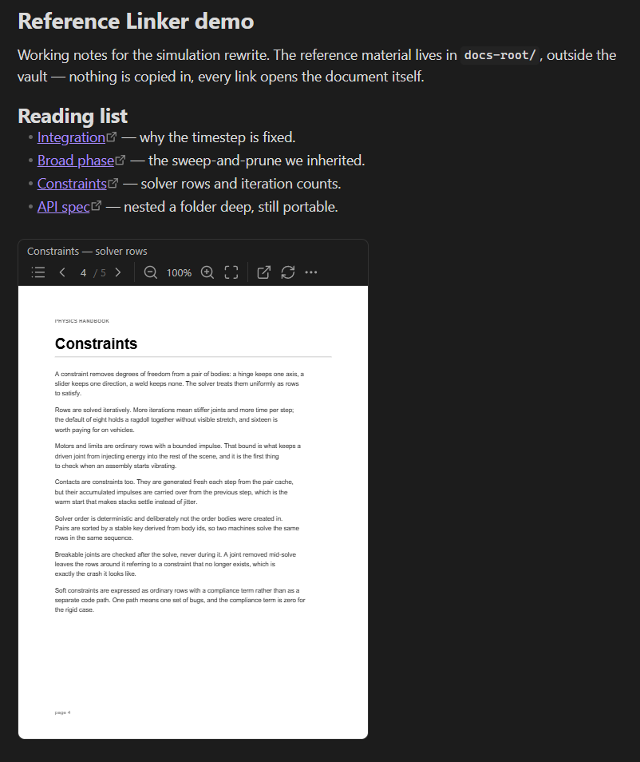
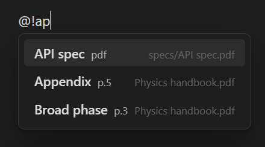
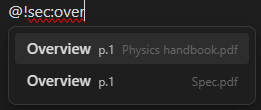
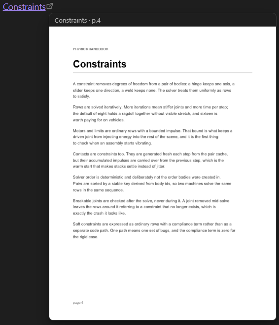
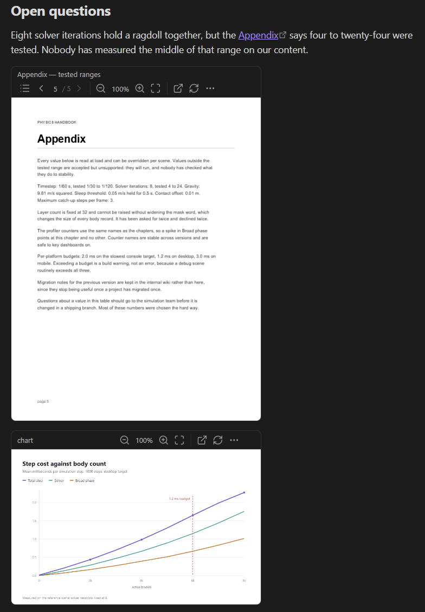
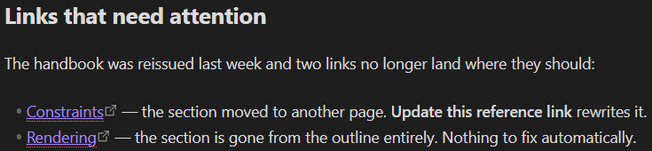
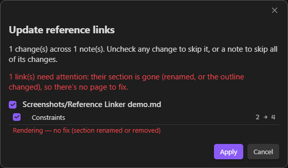
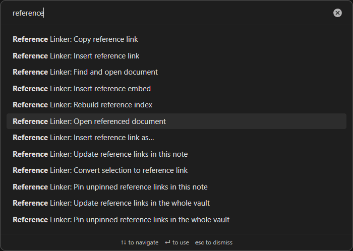
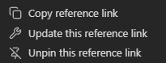
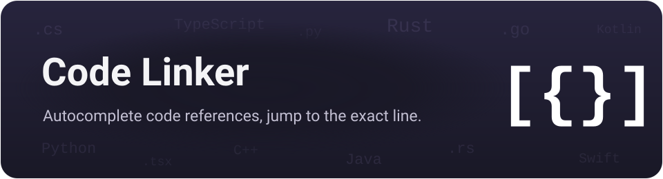

<p align="center">
  
</p>

# Reference Linker

<p align="center">
  <a href="https://community.obsidian.md/plugins/reference-linker"></a>
  <a href="https://github.com/max-fluff/obsidian-reference-linker/releases/latest"></a>
  <a href="LICENSE"></a>
</p>

An Obsidian plugin that autocompletes links to the documents living outside your vault — papers, manuals, decks, spreadsheets, e-books, recordings — and inserts a markdown link that opens the right page in your default app.

- **11 formats, 53 extensions, no converters.** PDF, Word, Excel, PowerPoint, OpenDocument, EPUB, HTML, Markdown, CSV, images, audio and video — every reader is the plugin's own. No pandoc, no LibreOffice, nothing to install alongside it.
- **Sections, not just file names.** Where a format carries an outline — a PDF's bookmarks, Word and HTML headings, a workbook's sheets, an EPUB's table of contents, one entry per slide — every section is indexed on its page, so `@!intro` finds the *Introduction* of a paper rather than the paper.
- **The document, shown in the note.** Hover a link for the page rendered, the slide drawn, the document laid out or the sheet as a real table; a ` ```reference-link ` block puts the same thing inline, and a range stacks several pages at once.
- **Links that notice the document changed.** A link pinned to its section is checked against the index: when the file is reissued and the section moves, the link is marked and updated in place, one note or the whole vault.
- **Nothing is copied in.** Notes keep a portable `{ref-root}` path, so the same vault works on another machine that keeps its library somewhere else.

It's the document counterpart to [Code Linker](https://github.com/max-fluff/obsidian-code-linker), which does the same for source code. Your reference material usually lives in project folders, download folders or a research library. This plugin makes it as linkable as a note.

Available in the Obsidian community catalog: **[community.obsidian.md/plugins/reference-linker](https://community.obsidian.md/plugins/reference-linker)**.

> Desktop only. It reads files from disk through Node's filesystem API, which isn't available on mobile.

<p align="center">
  
</p>

The plugin ships as `main.js`, `manifest.json` and `styles.css`. It scans the folders you configure and keeps the index in memory, so there's no index file to commit and nothing to generate: the index is rebuilt on startup and on demand. PDF outlines and page previews use the pdf.js that Obsidian already ships, so no second copy is bundled. `main.js` is built from `src/` with esbuild (see [Development](#development)).

## Contents

- [What it does](#what-it-does)
  - [Autocomplete as you type](#autocomplete-as-you-type)
  - [Drag & drop from your file manager](#drag--drop-from-your-file-manager)
  - [Document sections](#document-sections)
  - [Portable `{ref-root}` links](#portable-ref-root-links)
  - [Opening at a page](#opening-at-a-page)
  - [Hover preview](#hover-preview)
  - [Inline embeds](#inline-embeds)
  - [Keeping links current](#keeping-links-current)
- [Commands](#commands-command-palette-ctrlp)
- [Settings](#settings)
- [Skipped contexts](#skipped-contexts)
- [Public API](#public-api)
- [How it works](#how-it-works)
- [Development](#development)
- [Installation](#installation)
- [Compatibility](#compatibility)
- [Related plugins](#related-plugins)

## What it does

### Autocomplete as you type

Type a trigger (default `@!`) followed by a document name and pick a match. The plugin indexes the files under your **Reference root** by name, with fuzzy matching. Suggestions are suppressed inside code blocks, inline code, frontmatter and existing links (see [Skipped contexts](#skipped-contexts)).

<p align="center">
  
</p>

The inserted link looks like:

```markdown
[paper-with-outline](file:///{ref-root}/papers/paper-with-outline.pdf)
```

Filter a common name by an inline prefix: an extension (`pdf:`, `pptx:`, `png:`), `sec:` for sections only, or `file:` for whole files only. They stack, so `@!pdf:sec:intro` is the *Introduction* of a PDF and nothing else, and a prefix with no name yet (`@!pdf:`) simply lists what passes it. The same prefixes resolve an embed's target.

### Drag & drop from your file manager

Drop a document straight from your OS file manager into a note and pick whether it lands as a reference link or an inline embed — no need to type its name. A file already in the index keeps its indexed name; one that isn't gets a link by its file name. Only files under your **Reference root** can carry the portable `{ref-root}` token, so a file dropped from elsewhere is skipped with a notice rather than baked in as an absolute path. A drop with no in-root files is left to Obsidian, so dropping an image to import it into the vault still works as usual.

### Document sections

Where a format has an outline, the plugin reads it and indexes each section with its page number. It's the same idea as Code Linker indexing a symbol on its line, with a section on its page instead. So `@!intro` finds the *Introduction* section of a paper, and the inserted link carries that page, plus a `sec:` binding in the title that pins it to the section (see [Keeping links current](#keeping-links-current)):

```markdown
[Introduction](file:///{ref-root}/papers/paper-with-outline.pdf#page=1 "sec:Introduction")
```

<p align="center">
  
</p>

What each format gives you:

| Format | Sections | Preview | Embed toolbar | Opens at the position |
|---|---|---|---|---|
| PDF | outline (bookmarks) | page rendered by pdf.js | pages, zoom | yes — `#page=`, when the default app is a browser |
| HTML, XHTML | every heading that carries an `id` | the section's text | sections, zoom | yes — `#id`, and the browser is the default app |
| Markdown, txt, log | headings, on their line | the text itself | zoom | no — see below |
| EPUB | table of contents (EPUB 2 and 3) | the chapter's text | chapters, zoom | no |
| DOCX | heading styles | rendered document (lists, tables, images) | sections, zoom | no |
| XLSX | sheets | rendered as a table grid | sheets, zoom | no |
| PPTX | one per slide | the slide, drawn — its shapes, tables and pictures | slides, zoom | no |
| ODT | headings | rendered document (lists, tables, images) | sections, zoom | no |
| ODS | sheets | rendered as a table grid | sheets, zoom | no |
| ODP, ODG | slides, drawing pages | the page, drawn | pages, zoom | no |
| CSV, TSV | — | rendered as a table grid | zoom | no |
| Audio, video | — | the file, seeked to `#t=` seconds | play, seek, sound | no |
| Images | — | the image | zoom | — |
| Anything else, added under **Other extensions** | — | — | — | — |

HTML is the one worth setting up: generated documentation (AsciiDoc, Sphinx, Doxygen,
javadoc) puts an `id` on nearly every heading, so a link lands on the exact section in your
browser. A heading with no `id` — usually just the page title — is still indexed by name, it
simply opens the file at the top.

Markdown, HTML, EPUB, Word and ODT previews render as documents — headings, lists, tables,
code and the images they reference (read straight off disk or out of the file). An HTML page's
own stylesheet is applied too, confined to the preview so it can't restyle Obsidian. A
spreadsheet — `.xlsx` or `.ods` — renders as a real table, each cell shown under the number
format the sheet gives it: a currency column reads as `$32,370.00` and a date as a date, rather
than as the doubles and day counts they are stored as.

Word's sections come from its heading styles, and plenty of real documents have none; a `.docx`
with no outline is normal rather than a failure, and its preview shows the document either way.

A document with no outline — a PDF without bookmarks, a plain `.docx`, an `.epub` — is still indexed by file name, and its link still opens it. Only the section entries are missing.

Each of those formats is also read under the extensions its own application saves it as: the macro-enabled `.docm .xlsm .pptm .dotm .xltm .potm`, the templates `.dotx .xltx .potx .ott .ots .otp`. They are the same package under another name, and each format's row in **File extensions** lists every one of them. The flat single-file ODF (`.fodt .fods .fodp`) is not — it is one XML file rather than a zip, and it is not read.

### Portable `{ref-root}` links

`{ref-root}` is not expanded when the link is inserted. The note keeps the literal text `{ref-root}` and a relative path, and the absolute base is filled in only when the link is opened or rendered. That keeps notes portable across machines: the file on disk holds a relative path, and each machine supplies its own **Reference root**.

The token is namespaced so a link says which plugin owns it — Code Linker writes `{code-root}` into its own links. Notes written before the namespacing carry a bare `{root}`, which still resolves: it is read as this plugin's when a `sec:` binding or the path itself shows the link is ours, and left alone otherwise.

### Opening at a page

Click a link and the document opens in your OS default app. When that app is a browser, which is the common default for PDFs, a `#page=` link jumps straight to the page.

The link is handed to the OS through the shell, so the `#page=` fragment survives intact. Obsidian's own external-link opener mangles it, so the plugin routes clicks on PDF-page links itself. The commands and the hover/embed headers open the same way.

Not every viewer honours a fragment. PowerPoint, Word and most e-book readers are handed it as part of the path and then find no file at all, so the plugin doesn't write one for those formats — a `.pptx` section link opens the deck at the first slide. The section name goes to the clipboard when you open one, so the viewer's own search box takes you the rest of the way. Inside Obsidian the anchor is exact either way: hover and embeds open at the section the link names.

Which fragment a link carries is the format's business: `#page=` for a PDF, `#id` for HTML, `#t=` seconds for a recording, none where the viewer would choke on one.

### Hover preview

<p align="center">
  
</p>

Hover a reference link to preview it without leaving your notes — the PDF page rendered to a canvas, the slide drawn, the document or sheet laid out, the image itself; what each format shows is in the table above. PDF rendering uses the pdf.js that Obsidian already ships, so no second copy is bundled. In live preview, hold Ctrl/Cmd to show it, the way a note preview works; in reading view a plain hover is enough. Toggle it with **Preview on hover** in settings.

### Inline embeds

A fenced ` ```reference-link ` block renders a document page or image inline in the note, so the reference sits next to your writing without being copied in:

````markdown
```reference-link
papers/paper-with-outline.pdf#page=3
```
````

- A path (`papers/report.pdf`) shows the first page; add `#page=N` (or the older `:N` / `:N-M` suffix) for a specific page.
- An `#id` anchor works too (`guide.html#_options`) — the same fragment a copied HTML section link carries — resolved through the index to its section.
- A name or section (`Introduction`) is resolved through the index to its file and page.
- An image path shows the image; a `.pptx` path shows the slide drawn; a spreadsheet shows the sheet as a table.
- A **range** stacks several pages or sections: `report.pdf#page=3-5`, or a `page: 3-5` line. Paged and sectioned formats range; images and media render once. Up to 20 at a time, and each one is drawn as you scroll to it rather than all at once.
- A recording is positioned **in time, not in pages**: `time: 1:30` (or `1:02:05`, or plain seconds), or `clip.mp4#t=1:30` in the target — the same timecode the header shows. Each format takes only its own unit: `page:` on a recording, or `time:` on a paged document, is an error that names the right key rather than quietly starting from the top.
- Optional `key: value` lines after the target tune it, and they are the whole set: `page: N` (or `N-M`) for paged formats, `time: mm:ss` for recordings, `width: N` (CSS px, 600 by default), `zoom: 150%` or `zoom: fit` for the formats that zoom, and `title: …`, which replaces the header text — by default the section or document name and its position.

<p align="center">
  
</p>

#### The embed toolbar

An embed of a single position is a small viewer rather than a still: the header carries a toolbar, and each format shows only the controls it can honour (the table above says which).

- **Contents** — the document's own outline (a PDF's bookmarks, a deck's slide titles, a document's headings), as the index already read it: pick a section and the embed jumps to it. Shown when the file has more than one. A range gets it too, listing only the sections it actually shows and scrolling to them — the rest of the document isn't that block's to open.
- **Position** — `◀ 3 / 128 ▶`: pages in a PDF, slides in a deck, sheets in a spreadsheet, sections in a document, chapters in an EPUB. The number is a box: type one and press Enter. With the embed focused, `←` / `→` and `PageUp` / `PageDown` step, `Home` / `End` jump to the ends, and the wheel steps when the position itself has nowhere left to scroll. A document with only one position shows no arrows.
- **Zoom** — `−  100%  +`, plus **Fit width**. 100 % is the width the block asked for (the `width:` line, 600 px by default), and the ladder runs 50–300 %. `Ctrl`+wheel zooms, `+` / `−` step, `Ctrl+0` is 100 %, and a double-click toggles fit against 100 %. A page or a slide is redrawn larger; text, a sheet and a table are scaled where they stand. The embed itself keeps its size: what is zoomed scrolls inside it, rather than pushing the note around.
- **Open** / **Refresh** — on every embed, whatever its format. The title still opens the document too.
- **⋯** — the right-click menu, and the one place anything is written back: **Remember this view**. A toolbar button never edits your note.

A recording has no positions to page through, so it gets a transport under the header instead of the browser's bar: play, a bar filled to where it has got to, the clock, sound, and full screen for a video. It is as wide as the block asked for, the same as every other embed. An embed already has a header, and the browser's player brings a second one. With the transport focused, space plays and pauses, the arrows step five seconds and `m` mutes.

A position and a zoom are yours rather than the block's: they survive an index rebuild, but not closing the note. **Remember this view** writes them into the block as `page:` and `zoom:` lines, so it opens there next time. A range like `#page=3-5` stacks its positions and draws each as you scroll to it, so it takes the contents list but not the arrows; a Markdown or text file is positioned by line rather than by section, so it takes neither.

Embeds re-render when the index rebuilds, so an open embed follows changes on disk. The command **Insert reference embed** picks an entry and inserts the block.

### Keeping links current

A note is text first. In `[label](url "title")` the address is the url and the label is your prose, so the plugin reads neither for tracking: rename the label or retarget the link and nothing is second-guessed. Tracking is opt-in and lives in the title, as a binding.

A section link is inserted already pinned to its section:

```markdown
[whatever you like](file:///{ref-root}/papers/paper-with-outline.pdf#page=2 "sec:Methods")
```

The `sec:` binding is what the plugin follows. If the PDF is reissued and *Methods* moves to another page, the link gets a warning-coloured underline and can be fixed to the new page. If the section is gone from the outline, or the document isn't indexed, the underline is error-coloured. A link with no binding, or a title that names no section (a plain tooltip), is left alone. **Mark stale links** (on by default) toggles the underlines; they show in reading view and live preview.

<p align="center">
  
</p>

To fix drift:

- **Update reference links in this note** / **… in the whole vault** rewrite each drifted link's page, keeping its binding.
- Right-click a link for **Update this reference link** (when drifted), **Pin to section** (an unpinned link whose page begins a section), or **Unpin**.
- **Pin unpinned reference links in this note** / **… in the whole vault** retrofit notes written before pinning.

<p align="center">
  
</p>

Because the section is named in the title, not read from the label, the label stays yours to write however you like. A multi-word or non-ASCII section name is escaped in the binding (`sec:Chapter%201`) and shown in full again on hover.

## Commands (command palette, Ctrl+P)

- **Insert reference link** — insert a link at the cursor.
- **Insert reference link as…** — insert one link with a one-off viewer choice, leaving the default alone.
- **Open referenced document** — open the picked document without inserting.
- **Copy reference link** — copy the link with `{ref-root}` resolved to the absolute path (a copied link is usually pasted outside the vault, where the portable token wouldn't resolve).
- **Insert reference embed** — insert a ` ```reference-link ` block.
- **Convert selection to reference link** / **Find and open document** — resolve the selection against the index, then convert it or open the document (one match acts directly, several open the picker).
- **Update reference links in this note** / **… in the whole vault**.
- **Pin unpinned reference links in this note** / **… in the whole vault** — attach a `sec:` binding to links whose page begins a section.
- **Rebuild reference index**.

<p align="center">
  
</p>

### Priority among linker plugins

Install more than one linker and they will sometimes claim the same word or the same link. It goes to whichever sits highest in **Settings → Maintenance → Priority among linker plugins**, and the loser stands aside — no double highlight, one entry in the right-click menu, one merged list of suggestions while you type.

The list appears only when another linker is installed. Each plugin moves itself, so reordering may take a move from more than one settings tab; every arrangement is reachable that way.

The selection commands are also in the editor's right-click menu. Right-clicking an existing reference link adds link-specific items: **Copy reference link**, **Pin to section** / **Unpin**, and **Update this reference link** when its section has drifted.

<p align="center">
  
</p>

## Settings

**Reference index**
| Setting | Default | What it does |
| --- | --- | --- |
| **Reference root** | vault's parent folder | Base folder the scan paths resolve against. Empty = the folder containing the vault. |
| **Scan folders** | whole root | One path per line, relative to the reference root. Empty scans the whole root. |
| **File extensions** | none | Every format the plugin reads, one row each: turn a format on to index all its extensions, or open the row and pick single ones. Nothing is indexed until something is on, so set this first. |
| **Other extensions** | none | Anything else you want indexed. Found by file name only — no preview, no sections. |
| **Skip folders** | `.git`, `node_modules`, `.obsidian` | A bare name is skipped at any depth; a path with a slash skips only that folder. |
| **Auto-refresh index** | on | Watch the scan folders and rebuild when documents change. Linux has no recursive watch, so there the plugin falls back to watching each directory of the tree; it works, but a very large tree can hit the OS watch limit (the plugin says so if it does). |

**Suggestions & links**
| Setting | Default | What it does |
| --- | --- | --- |
| **Trigger** | `@!` | Text that starts a suggestion. (`@@` is Code Linker's default; `@!` avoids a clash when both are installed.) |
| **Min characters / Max results** | `1` / `12` | When suggestions appear, and how many. |
| **Viewer link preset** | file:// | The link format. With **ask-on-insert** you pick per link; add your own named URL templates under **Your viewers**. |
| **Editor context menu** | on | Add the convert/open items to the editor right-click menu. |

**Your viewers** are named URL templates. `{abs}`, `{path}`, `{page}` and `{name}` are filled in when the link is built; `{ref-root}` stays in the note and resolves when the link is opened or rendered. The result is handed to the OS as a URL, so a template has to be one, not a command line. A `file://` template that carries no fragment of its own gets the format's own (`#page=`, `#id`) appended when the entry is a section — under any other scheme the position goes only where you put `{page}`.

**Hover preview**
| Setting | Default | What it does |
| --- | --- | --- |
| **Preview on hover** | on | Preview the document when you hover a link. |
| **Document preview shape** | text column | How a Word or OpenDocument preview is laid out: a text column whose height follows the content, or the whole page the document declares. The page size and margins come from the file either way. |

**Links**: **Mark stale links** (on).

### Styling

Everything the plugin draws around a document is exposed to the [Style Settings](https://github.com/mgmeyers/obsidian-style-settings) plugin under a *Reference Linker* section: the stale/broken underline colours and style, how tall an embed and a hover preview grow before they scroll, and how visible an embed's toolbar is when the pointer is elsewhere. They're plain CSS variables, so a snippet does just as well — `--reference-linker-stale-color`, `--reference-linker-broken-color`, `--reference-linker-mark-underline-style`, `--reference-linker-embed-height`, `--reference-linker-hover-height`, `--reference-linker-embed-tools-idle` (set that last one to `0` and the toolbar stays out of the way until you hover the embed).

One thing is deliberately not yours to restyle: the paper a document is drawn on. A rendered page, slide or sheet keeps its own white sheet and its own colours in a dark vault, because that is what the document looks like — and it is drawn in an isolated frame your vault's CSS cannot reach into, which is the same thing that stops the document's own stylesheet reaching out.

## Skipped contexts

Suggestions never fire inside code blocks (` ``` ` and `~~~`), inline code, frontmatter, or existing `[[...]]` and `[..](..)` links. When a link is written into a Markdown table cell, the pipe is escaped so the table isn't broken. Stale/broken marks and the **Update reference links** commands skip links inside code too, where they're example text rather than live links.

## Public API

The in-memory index is exposed at `app.plugins.plugins['reference-linker'].api`:

| Method | Returns |
| --- | --- |
| `getEntries()` | every entry: `{ name, kind, ext, path, position }` (`kind` is `file` or `section`; `position` is a page, slide, chapter, heading or second, per format) |
| `getFiles()` | one row per file: `{ name, path, ext, entries }` |
| `getStats()` | `{ files, entries, byExt, byKind }` |
| `find(text)` | entries matching a name or path tail |
| `linkFor(entry)` | the portable `[name](uri)` markdown link |
| `uriFor(entry)` | a ready-to-open absolute URI (`{ref-root}` resolved) |
| `onChange(cb)` | subscribe to rebuilds; returns an unsubscribe function |
| `version`, `root()` | plugin version; the resolved reference root |

A DataviewJS example that counts indexed documents per type:

````md
```dataviewjs
const api = app.plugins.plugins['reference-linker']?.api;
if (!api) { dv.paragraph('Reference Linker is not enabled.'); }
else {
  const { byExt } = api.getStats();
  dv.table(['Type', 'Count'], Object.entries(byExt));
}
```
````

## How it works

A rebuild re-reads only files whose modification time changed, so a large library re-indexes quickly and a PDF's outline is parsed only when that file actually changes. The per-keystroke check that suppresses suggestions in code, links and frontmatter tests just the cursor position, not the whole document.

The plugin reads documents from arbitrary paths on disk through Node's filesystem API, since the whole point is that they live outside your vault. That's why it's desktop-only (`isDesktopOnly`) and why it asks for a **Reference root** rather than using the vault.

## Development

The plugin is written as small CommonJS modules in `src/` and bundled into `main.js` by esbuild. `main.js` is generated: edit `src/` and rebuild.

Generic code shared with the sibling linker plugins lives in `src/shared/`, a git submodule of [obsidian-linker-shared](https://github.com/max-fluff/obsidian-linker-shared). Clone with `--recurse-submodules`:

```sh
git clone --recurse-submodules https://github.com/max-fluff/obsidian-reference-linker
npm install      # once, installs esbuild
npm run build    # bundle src/ -> main.js
```

In an existing clone without the submodule, run `git submodule update --init` first.

`src/` layout:

- `main.js` — the `Plugin` class: lifecycle, settings, folder scan, link building; applies the mixins below.
- `constants.js` — default settings and the `file://` preset.
- `formats/` — one module per document format: which extensions it claims, what it outlines, how it previews, what anchor its links carry. The only place that branches on an extension; see [`CONTRIBUTING.md`](CONTRIBUTING.md) for the handler contract.
- `zip.js`, `xml.js` — the readers the packaged formats (OOXML, ODF, EPUB) share.
- `suggest.js` — the `EditorSuggest` that drives autocomplete.
- `filter.js` — the inline `pdf:` / `sec:` query filter.
- `pdf.js` — Obsidian's pdf.js via `loadPdfJs()`: outline reading and page rendering.
- `hover.js` — the preview popover.
- `embed.js` — the inline ` ```reference-link ` block renderer.
- `actualize.js` — stale/broken detection and the "Update reference links" actions.
- `api.js` — the public API mixin (`app.plugins.plugins['reference-linker'].api`).
- `modal.js` — the fuzzy pickers (index entries, viewer formats).
- `settings-tab.js` — the settings UI.
- `styles.css` — this plugin's own styles; the shipped `styles.css` is assembled from the shared ones plus this by `npm run build`.
- `shared/` — git submodule shared with the sibling linker plugins: markdown helpers, the link-binding grammar, the i18n engine, the folder-list settings editor, the folder autocomplete, and the family's branding generators (dev-only, nothing under `shared/branding/` is bundled).
- `locales/` — interface strings (English and Russian), fed to the shared i18n engine.

The header images are generated rather than hand-drawn. `docs/branding.config.mjs` holds this plugin's mark, motif and copy, and the shared generators turn it into the assets:

```sh
npm run banner   # docs/images/banner.svg + social-preview.svg
npm run plates   # store screenshot backdrops -> docs/images/store/
```

`icon.svg` and `icon-mono.svg` are hand-written, and the config reuses their paths verbatim, so the mark on the icon, the banner and the store plates is one drawing. See [`BRANDING.md`](src/shared/branding/BRANDING.md) for the conventions.

To deploy into a test vault on each build, create `esbuild.local.mjs` exporting `deployTargets` (a list of plugin folders to copy the build into). `node_modules/`, `test-vault/` and `esbuild.local.mjs` are git-ignored.

## Installation

This plugin is desktop-only, since it reads the filesystem.

**From Obsidian (recommended).** Open *Settings → Community plugins → Browse*, search for **Reference Linker**, then *Install* and *Enable*. You can also open its catalog page directly: [community.obsidian.md/plugins/reference-linker](https://community.obsidian.md/plugins/reference-linker).

**Manually.** Download `main.js`, `manifest.json` and `styles.css` from the [latest release](https://github.com/max-fluff/obsidian-reference-linker/releases/latest) into `<vault>/.obsidian/plugins/reference-linker/`, then enable the plugin in *Settings → Community plugins*.

**Beta builds via [BRAT](https://github.com/TfTHacker/obsidian42-brat).** Add the repository `max-fluff/obsidian-reference-linker` to test unreleased changes before they reach the catalog.

After enabling, set **Reference root** and turn on the **File extensions** to index. The index stays empty until at least one of them is on.

## Compatibility

Requires Obsidian 1.4.0 or newer. Desktop-only: the index is built by reading the filesystem through Node's API, which isn't available on mobile. On Linux, where Node has no recursive `fs.watch`, **Auto-refresh index** falls back to watching each directory of the scan tree; it works, but a very large tree can hit the OS watch limit (the plugin says so, and a manual rebuild always works). Interface in English and Russian, following Obsidian's language.

None of these are required, the plugin runs on its own, but it cooperates with them if you have them installed:

- **[Style Settings](https://github.com/mgmeyers/obsidian-style-settings)** — a UI for the stale/broken underline colours and style, and for the height of an embed and a hover preview and how visible an embed's toolbar is.
- **[Dataview](https://github.com/blacksmithgu/obsidian-dataview)** — query the index from DataviewJS through the [public API](#public-api).

## Related plugins

The rest of the linker family, also by the author. Two of them autocomplete a name into a deep-link that lands on the exact spot, and two highlight words already in your notes and link them.

**[Code Linker](https://community.obsidian.md/plugins/code-linker)** — autocompletes references to your source code and inserts a deep-link that opens the file at the exact line in your editor (VS Code, JetBrains, …). Desktop-only. This plugin is its document counterpart, with a section on its page instead of a symbol on its line.

<p align="center">
  <a href="https://community.obsidian.md/plugins/code-linker">
    
  </a>
</p>

**[Glossary Linker](https://community.obsidian.md/plugins/glossary-linker)** — highlights glossary terms in any word form, turns them into real links, and learns new aliases from links you've already made. Works on desktop and mobile.

<p align="center">
  <a href="https://community.obsidian.md/plugins/glossary-linker">
    
  </a>
</p>

**[Heading Linker](https://community.obsidian.md/plugins/heading-linker)** — the file-based sibling of Glossary Linker: each heading inside a chosen file is a term, matched in any word form and turned into a link. Works on desktop and mobile.

<p align="center">
  <a href="https://community.obsidian.md/plugins/heading-linker">
    
  </a>
</p>

## License

MIT, see [`LICENSE`](LICENSE).
